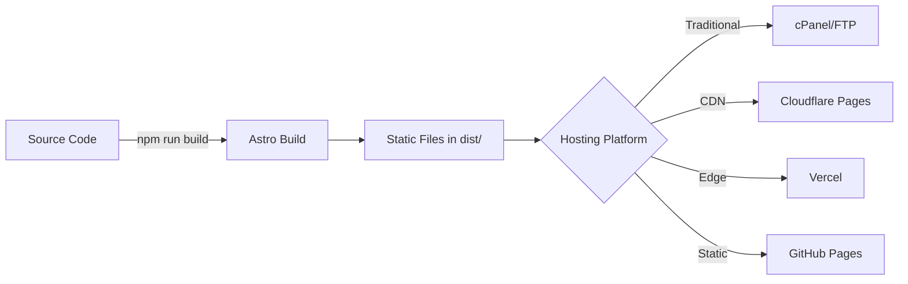
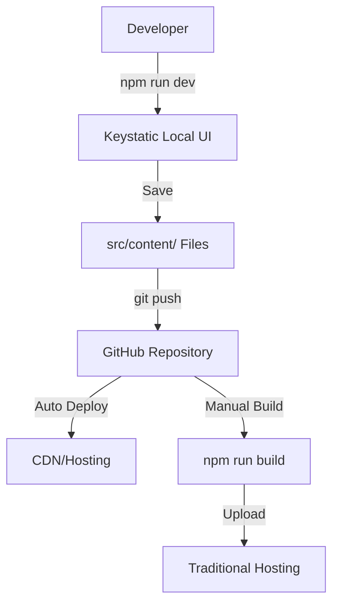

# دليل المطور (Developer Guide)

هذا الدليل موجه للمطورين الذين يرغبون في فهم البنية التقنية للمشروع، أو المساهمة فيه، أو تخصيص الإعدادات المتقدمة.

---

## 🏗️ البنية التقنية

المشروع مبني باستخدام **Astro** كإطار عمل أساسي، مع **React** للمكونات التفاعلية، و **Keystatic** لإدارة المحتوى، و **Security Middleware** لرؤوس الأمان.

### هيكل الملفات الرئيسي

```
/
├── keystatic.config.ts    # إعدادات Keystatic (Schema)
├── astro.config.mjs       # إعدادات Astro + Image optimization
├── src/
│   ├── middleware/        # Security middleware
│   │   └── index.ts       # رؤوس الأمان
│   ├── content/           # المحتوى (يُدار بواسطة Keystatic)
│   │   ├── blog/          # ملفات المقالات (.mdoc)
│   │   ├── authors/       # ملفات المؤلفين (.mdoc)
│   │   ├── contact/       # بيانات صفحة الاتصال (data.json) ⭐ جديد
│   │   └── settings/      # إعدادات الموقع (.json/.yaml)
│   ├── components/        # مكونات الواجهة (Astro/React)
│   │   └── OptimizedImage.astro  # مكون الصور المحسّنة ⭐
│   ├── layouts/           # تخطيطات الصفحات
│   └── pages/             # مسارات الموقع (Routes)
│       ├── contact.astro  # صفحة الاتصال (تقرأ من CMS)
│       └── keystatic/     # مسار لوحة التحكم
├── public/                # الملفات العامة والصور
│   └── .htaccess          # إعدادات Apache للاستضافة التقليدية
└── .github/workflows/     # GitHub Actions
    ├── deploy-namecheap.yml    # نشر تلقائي عبر FTP
    └── compress-images.yml     # ضغط الصور وتحويلها لـ WebP
```

---

## 🔒 نظام الأمان (Security System)

### رؤوس الأمان (Security Headers)

المشروع يستخدم **Astro Middleware** لإضافة رؤوس أمان لجميع الصفحات.

#### الملف: `src/middleware/index.ts`

```typescript
// رؤوس الأمان الأساسية المطبقة:
- X-Frame-Options: SAMEORIGIN
- X-Content-Type-Options: nosniff
- X-XSS-Protection: 1; mode=block
- Referrer-Policy: strict-origin-when-cross-origin
- Permissions-Policy: camera=(), microphone=(), geolocation=()
- Content-Security-Policy: [سياسة متوازنة]
```

#### Content Security Policy (CSP)

تم تكوين CSP للسماح بالموارد الضرورية:

- **Scripts:** نفس النطاق + inline (لـ Astro) + unpkg.com (للمكتبات الخارجية)
- **Styles:** نفس النطاق + inline + Google Fonts
- **Images:** نفس النطاق + data URIs + https
- **Fonts:** نفس النطاق + Google Fonts
- **Frames:** نفس النطاق فقط

### تخصيص رؤوس الأمان

لتعديل رؤوس الأمان، افتح `src/middleware/index.ts`:

```typescript
// مثال: إضافة مصدر جديد للصور
const cspDirectives = [
  // ... الإعدادات الحالية
  "img-src 'self' data: blob: https: https://example.com", // أضف المصدر هنا
];
```

> ⚠️ **تحذير:** كن حذراً عند تعديل CSP. قد تؤدي الإعدادات الصارمة جداً إلى منع بعض الوظائف.

---

## 🔄 ملخص الانتقال (Migration Summary)

تم نقل نظام إدارة المحتوى من **Decap CMS** إلى **Keystatic** للأسباب التالية:
1. **Local-First:** إمكانية إدارة المحتوى محلياً دون الحاجة لاتصال بالإنترنت أو خوادم خارجية.
2. **Type Safety:** تكامل أفضل مع TypeScript.
3. **المرونة:** سهولة التعامل مع الحقول المخصصة والعلاقات بين البيانات.
4. **دعم العربية:** حل مشاكل الروابط (Slugs) مع العناوين العربية.

### التغييرات الرئيسية التي تمت:

1. **إزالة Decap CMS:**
   - حذف مجلد `public/admin`.

2. **تثبيت Keystatic & Markdoc:**
   - إضافة `@keystatic/astro` و `@astrojs/markdoc`.
   - إنشاء ملف `keystatic.config.ts` لتعريف هيكل البيانات (Schema).

3. **تحويل المحتوى:**
   - تحويل ملفات `.md` إلى `.mdoc`.
   - فصل حقل `slug` (اسم الملف) عن `title` (العنوان) في الـ Frontmatter لدعم العناوين العربية بأسماء ملفات إنجليزية نظيفة.

4. **إضافة Security Middleware:**
   - إنشاء `src/middleware/index.ts` لرؤوس الأمان.

---

## 🛠️ التعامل مع Keystatic برمجياً

### 1. ملف الإعدادات (`keystatic.config.ts`)

هذا الملف هو "قلب" نظام إدارة المحتوى. هنا نعرّف المجموعات (Collections) والصفحات الفردية (Singletons).

مثال لتعريف مجموعة "المقالات":

```typescript
blog: collection({
  label: 'المقالات',
  slugField: 'slug', // الحقل المستخدم كاسم للملف
  path: 'src/content/blog/*', // مسار الحفظ
  format: { contentField: 'content' }, // استخدام Markdoc للمحتوى
  schema: {
    title: fields.slug({ name: { label: 'العنوان' } }),
    slug: fields.text({ label: 'الرابط (Slug)', description: 'اسم الملف بالإنجليزية' }),
    // ... باقي الحقول
  },
}),
```

### 2. استخدام المحتوى في Astro

نستخدم `getCollection` من `astro:content` لجلب البيانات:

```typescript
import { getCollection } from 'astro:content';
const posts = await getCollection('blog');
```

---

## 🧩 إضافة ميزات جديدة

### إضافة حقل جديد للمقالات

1. افتح `keystatic.config.ts`.
2. اذهب إلى `collections.blog.schema`.
3. أضف الحقل الجديد:
   ```typescript
   readingTime: fields.integer({ label: 'وقت القراءة (دقائق)' }),
   ```
4. افتح `src/content/config.ts` وحدث تعريف الـ Collection في Astro (Zod Schema) ليتطابق مع Keystatic.

### إضافة نوع محتوى جديد (مثلاً: مشاريع)

1. عرّف Collection جديد في `keystatic.config.ts`.
2. أنشئ مجلد `src/content/projects`.
3. عرّف الـ Collection في `src/content/config.ts`.

---

## 🚀 بنية النشر (Deployment Architecture)

### بناء ثابت (Static Build)



### تدفق إدارة المحتوى (Content Management Flow)



---

## 🐛 استكشاف الأخطاء وإصلاحها

### مشكلة: "Field validation failed"
- **السبب:** البيانات في ملفات المحتوى (`.mdoc`) لا تطابق الـ Schema في `keystatic.config.ts`.
- **الحل:** تأكد من أن الحقول المطلوبة موجودة في جميع الملفات.

### مشكلة: الصور لا تظهر
- **السبب:** مسار الصورة غير صحيح.
- **الحل:** Keystatic يحفظ الصور في `public/images/`. تأكد من أن المسار في الـ Frontmatter يبدأ بـ `/images/`.

### مشكلة: رؤوس الأمان تمنع تحميل مورد معين
- **السبب:** CSP صارمة جداً.
- **الحل:** عدّل `src/middleware/index.ts` وأضف المصدر المطلوب إلى الـ directive المناسب.

### مشكلة: البناء فشل (Build Failed)
- **الأسباب المحتملة:**
  1. خطأ في Frontmatter لأحد المقالات
  2. مسار صورة مفقود
  3. خطأ TypeScript
- **الحل:**
  ```bash
  # اقرأ رسالة الخطأ بعناية - عادة تشير للملف المشكلة
  npm run build
  ```

---

## 🧪 الاختبار

### اختبار محلي

```bash
# بناء المشروع
npm run build

# معاينة البناء
npm run preview
```

### اختبار رؤوس الأمان

1. شغّل `npm run preview`
2. افتح Developer Tools في المتصفح
3. اذهب إلى Network tab
4. حمّل أي صفحة
5. اضغط على الطلب وشاهد Response Headers

يجب أن ترى:
- `X-Frame-Options: SAMEORIGIN`
- `Content-Security-Policy: ...`
- وغيرها من الرؤوس

---

## 📊 الأداء (Performance)

### تحسينات مُطبقة

- ✅ **Static Site Generation:** لا يوجد server-side rendering
- ✅ **Image Optimization:** صور متجاوبة وبصيغة WebP
- ✅ **Code Splitting:** تقسيم الكود تلقائياً بواسطة Astro
- ✅ **Lazy Loading:** تحميل كسول للصور
- ✅ **CDN Ready:** جاهز للعمل مع CDN عالمي

### قياس الأداء

استخدم أدوات مثل:
- [Google PageSpeed Insights](https://pagespeed.web.dev/)
- [GTmetrix](https://gtmetrix.com/)
- Lighthouse في Chrome DevTools

### قياس الأداء

استخدم أدوات مثل:
- [Google PageSpeed Insights](https://pagespeed.web.dev/)
- [GTmetrix](https://gtmetrix.com/)
- Lighthouse في Chrome DevTools

---

## 📞 صفحة الاتصال ولوحة التحكم

تم تحويل صفحة "اتصل بنا" لتكون قابلة للإدارة بالكامل من Keystatic CMS.

### 1. هيكل البيانات

- **المصدر:** `src/content/contact/data.json`
- **Keystatic Config:** تم تعريف Singleton باسم `contactPage`.

### 2. كيف نقرأ البيانات؟

نقرأ ملف JSON مباشرة في `src/pages/contact.astro`:

```javascript
import contactData from "../content/contact/data.json";
const { pageTitle, contactInfo } = contactData;
```

هذا الأسلوب يوفر أداءً عالياً جداً (Zero Runtime Overhead) لأن البيانات تُدمج أثناء البناء.

---

## 🔐 الأمان المتقدم (Advanced Security)

### HTTPS

تأكد من تفعيل HTTPS على موقعك:
- **Cloudflare Pages/Vercel/GitHub Pages:** تلقائي
- **الاستضافة التقليدية:** احصل على شهادة SSL من لوحة التحكم

### تحديث التبعيات (Dependencies)

راقب الثغرات الأمنية في المكتبات:

```bash
# فحص الثغرات
npm audit

# إصلاح تلقائي
npm audit fix
```

### سياسات الخصوصية

المشروع يتضمن صفحات:
- `/privacy` - سياسة الخصوصية
- `/terms` - شروط الاستخدام

عدّلها حسب احتياجاتك في `src/pages/`.

---

## 🌍 النشر على منصات مختلفة

### متغيرات البيئة (Environment Variables)

إذا احتجت لمتغيرات بيئة:

1. أنشئ ملف `.env`:
   ```env
   PUBLIC_API_URL=https://api.example.com
   ```

2. استخدمها في الكود:
   ```typescript
   const apiUrl = import.meta.env.PUBLIC_API_URL;
   ```

3. على منصات الاستضافة السحابية، أضفها من لوحة التحكم.

### تخصيص Base Path

لـ GitHub Pages أو Subfolders:

```javascript
// astro.config.mjs
export default defineConfig({
  site: 'https://username.github.io',
  base: '/repository-name', // اسم المستودع
});
```

---

## 📚 مصادر مفيدة

- [توثيق Astro](https://docs.astro.build/)
- [توثيق Keystatic](https://keystatic.com/docs)
- [توثيق Markdoc](https://markdoc.dev/)
- [OWASP Security Headers](https://owasp.org/www-project-secure-headers/)
- [MDN Web Docs - CSP](https://developer.mozilla.org/en-US/docs/Web/HTTP/CSP)

---

## 🤝 المساهمة

إذا أردت المساهمة في تطوير المشروع:

1. Fork المستودع
2. أنشئ branch جديد: `git checkout -b feature/amazing-feature`
3. Commit تغييراتك: `git commit -m 'Add amazing feature'`
4. Push إلى branch: `git push origin feature/amazing-feature`
5. افتح Pull Request

راجع [CONTRIBUTING.md](CONTRIBUTING.md) للمزيد من التفاصيل.

---

**نصيحة للمطورين:** استخدم TypeScript بشكل كامل للاستفادة من type safety. Keystatic يولد types تلقائياً للمحتوى! 🎯
