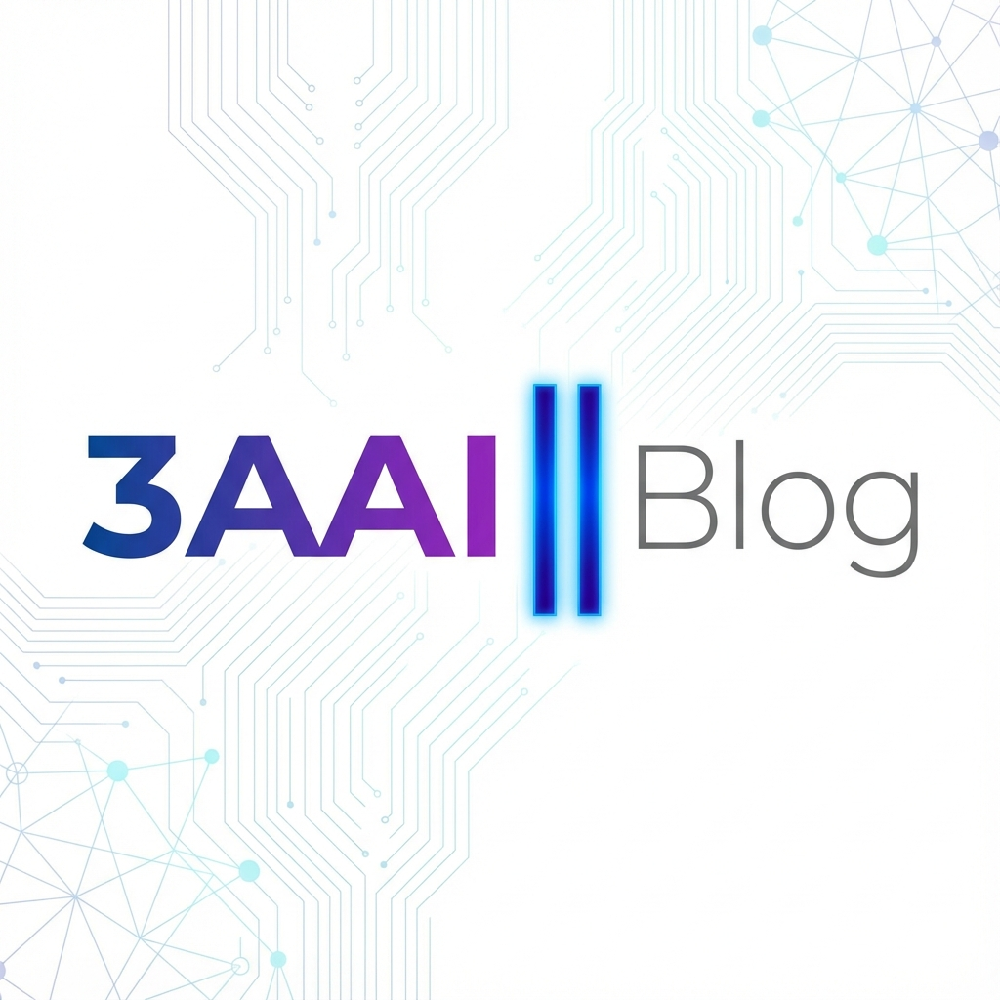

# 🌟 دَوٍن (Dawen) - قالب إدارة محتوى عربي

<div align="center">

**قالب إدارة محتوى عربي مفتوح المصدر من 3AAI**

قالب مدونة عربي احترافي مبني على Astro مع لوحة تحكم مرئية (Decap CMS) وتصميم داكن جذاب.


**المطور:** أحمد علي عبداللطيف | **الموقع:** [3aai.in](https://3aai.in)

</div>



---

## 🎯 جرّب النسخة التجريبية

<div align="center">

### 🌐 معاينة حية (Live Demo)

[](https://demo-dawen.netlify.app)

**[👉 شاهد المدونة الآن](https://demo-dawen.netlify.app)**

---

### 🚀 أنشئ نسختك الخاصة بضغطة واحدة!

[](https://app.netlify.com/start/deploy?repository=https://github.com/yourusername/dawen)

**الميزة:** ستحصل فوراً على نسخة كاملة من المدونة + لوحة تحكم خاصة بك!

</div>

---

## 📖 كيف تجرب المشروع؟

### الطريقة 1️⃣: معاينة الواجهة الأمامية (للقراءة فقط)

- **الرابط:** [https://demo-dawen.netlify.app](https://demo-dawen.netlify.app)
- **ماذا يمكنك رؤيته:**
  - ✅ التصميم الداكن الاحترافي
  - ✅ سرعة التحميل والأداء
  - ✅ التجاوب على جميع الأجهزة
  - ✅ نظام البحث والتصفية
  - ✅ صفحات المقالات والتصنيفات

### الطريقة 2️⃣: تجربة لوحة التحكم (CMS)

**لماذا لا يوجد حساب تجريبي؟**  
لوحة التحكم (Decap CMS) تتطلب حساب GitHub وصلاحيات كتابة على المستودع لأسباب أمنية.

**الحل:** أنشئ نسختك الخاصة مجاناً! 🎁

#### خطوات بسيطة:

1. **اضغط على زر "Deploy to Netlify"** أعلاه
2. **سجّل الدخول** بحساب GitHub (أو أنشئ حساب مجاني)
3. **اضغط "Connect to GitHub"** - سيتم نسخ المشروع لحسابك تلقائياً
4. **انتظر دقيقة واحدة** - Netlify سينشر موقعك تلقائياً
5. **افتح لوحة التحكم:** `your-site-name.netlify.app/admin`
6. **سجّل الدخول بحساب GitHub** وابدأ التجربة! 🎉

**ماذا يمكنك فعله في لوحة التحكم:**
- ✍️ كتابة مقالات جديدة
- 🖼️ رفع الصور مباشرة
- 👁️ معاينة المقالات قبل النشر
- 📝 حفظ المسودات
- 🗑️ حذف أو تعديل المقالات

### الطريقة 3️⃣: التثبيت المحلي (للمطورين)

```bash
# استنساخ المشروع
git clone https://github.com/yourusername/3aai-blog.git
cd 3aai-blog

# تثبيت الاعتماديات
npm install

# تشغيل الخادم المحلي
npm run dev

# (اختياري) لتجربة لوحة التحكم محلياً
# افتح ترمينال جديد وشغل:
npm run cms-proxy
```

الموقع سيعمل على: `http://localhost:4321`

---

## 🎥 فيديو توضيحي

> 📹 **قريباً:** فيديو يشرح كيفية استخدام لوحة التحكم خطوة بخطوة

---

## ✨ المميزات

### 🎨 التصميم
- ✅ ثيم داكن افتراضي (Dark Mode) مع إمكانية التبديل للوضع الفاتح
- ✅ تدرجات لونية جميلة في قسم الترحيب
- ✅ خط Cairo العربي الاحترافي
- ✅ تصميم متجاوب بالكامل (Responsive)
- ✅ رسوم متحركة سلسة (Smooth Animations)

### 📝 إدارة المحتوى
- ✅ **Decap CMS** - لوحة تحكم مرئية سهلة الاستخدام
- ✅ إضافة/تعديل/حذف المقالات من الواجهة
- ✅ رفع الصور مباشرة
- ✅ معاينة المقالات قبل النشر
- ✅ نظام المسودات (Drafts)

### 🔍 SEO & الأداء
- ✅ Open Graph Tags للمشاركة على وسائل التواصل
- ✅ Twitter Cards
- ✅ Sitemap تلقائي
- ✅ robots.txt
- ✅ تحسين الصور (Image Optimization)
- ✅ Lazy Loading

### 🚀 الميزات التفاعلية
- ✅ نظام بحث في المقالات
- ✅ زر العودة للأعلى (Back to Top)
- ✅ أزرار مشاركة المقالات (Twitter, Facebook, LinkedIn, WhatsApp)
- ✅ نسخ الرابط

### 📄 الصفحات
- ✅ الصفحة الرئيسية
- ✅ صفحة المقالات
- ✅ صفحة التصنيفات
- ✅ صفحة الوسوم
- ✅ صفحة من نحن
- ✅ صفحة اتصل بنا
- ✅ صفحة الأرشيف
- ✅ صفحة سياسة الخصوصية
- ✅ صفحة شروط الاستخدام
- ✅ صفحة 404 مخصصة

---

## 🛠️ التقنيات المستخدمة

- **[Astro](https://astro.build/)** - إطار العمل الأساسي
- **[Decap CMS](https://decapcms.org/)** - نظام إدارة المحتوى
- **[React](https://react.dev/)** - للمكونات التفاعلية
- **TypeScript** - للكتابة الآمنة
- **CSS Variables** - للتخصيص السهل

---

## 📦 التثبيت السريع

```bash
# استنساخ المشروع
git clone https://github.com/yourusername/3aai-blog.git
cd 3aai-blog

# تثبيت الاعتماديات
npm install

# تشغيل الخادم المحلي
npm run dev
```

الموقع سيعمل على: `http://localhost:4321`

---

## 📚 التوثيق

- [دليل التثبيت الكامل](INSTALLATION.md)
- [دليل المستخدم (Decap CMS)](USER_GUIDE.md)
- [دليل النشر](DEPLOYMENT.md)

---

## 🎯 الاستخدام

### إضافة مقال جديد (بدون CMS)

1. أنشئ ملف `.md` في `src/content/blog/`
2. أضف البيانات الأساسية (Front Matter):

```markdown
---
title: "عنوان المقال"
description: "وصف المقال"
date: 2025-11-30
author: "اسم الكاتب"
category: "التصنيف"
tags: ["وسم1", "وسم2"]
image: "/images/blog/article.png"
---

محتوى المقال هنا...
```

### إضافة مقال عبر CMS

1. اذهب إلى `/admin`
2. سجّل الدخول بحساب GitHub
3. اضغط على "New المقالات"
4. املأ البيانات واضغط "Publish"

---

## 🎨 التخصيص

### تغيير الألوان

عدّل `src/styles/global.css`:

```css
:root {
  --color-primary: #3b82f6;
  --color-background: #000000;
  /* ... */
}
```

### تغيير الشعار

استبدل `public/logo.png` بشعارك.

### تحديث معلومات الموقع

عدّل `src/config/site.ts`:

```typescript
export const siteConfig = {
  title: 'اسم مدونتك',
  description: 'وصف مدونتك',
  // ...
};
```

---

## 🚀 النشر

### Netlify (موصى به) ⭐

الطريقة الأسهل والأسرع لنشر مدونتك:

1. **اضغط على الزر أدناه:**

   [](https://app.netlify.com/start/deploy?repository=https://github.com/yourusername/3aai-blog)

2. **سجّل الدخول** بحساب GitHub
3. **اضغط "Save & Deploy"**
4. **انتهى!** موقعك جاهز على `your-site-name.netlify.app`

**المميزات:**
- ✅ نشر تلقائي عند كل تحديث (CI/CD)
- ✅ لوحة تحكم Decap CMS جاهزة فوراً
- ✅ شهادة SSL مجانية
- ✅ CDN عالمي سريع

### Vercel

بديل ممتاز مع أداء رائع:

[](https://vercel.com/new/clone?repository-url=https://github.com/yourusername/3aai-blog)

**ملاحظة:** ستحتاج لإعداد Decap CMS يدوياً مع Vercel.

### خيارات أخرى

- **GitHub Pages** - مجاني للمستودعات العامة
- **Cloudflare Pages** - سريع جداً
- **استضافة تقليدية** (Hostinger, cPanel) - راجع [دليل النشر](DEPLOYMENT.md)

راجع [دليل النشر الكامل](DEPLOYMENT.md) للتفاصيل والإعدادات المتقدمة.

---

## ❓ الأسئلة الشائعة (FAQ)

### س: لماذا لا يمكنني الدخول للوحة التحكم في النسخة التجريبية؟

**ج:** لوحة التحكم (Decap CMS) تتطلب حساب GitHub وصلاحيات كتابة على المستودع. لأسباب أمنية، لا يمكننا توفير حساب مشترك للجميع. **الحل:** استخدم زر "Deploy to Netlify" للحصول على نسختك الخاصة مجاناً!

### س: هل النشر على Netlify مجاني؟

**ج:** نعم! Netlify يوفر خطة مجانية سخية تكفي لمعظم المدونات الشخصية والمتوسطة. تشمل:
- 100 GB Bandwidth شهرياً
- 300 دقيقة Build شهرياً
- نشر تلقائي غير محدود
- SSL مجاني
- CDN عالمي

### س: هل يمكنني استخدام المشروع تجارياً؟

**ج:** للاستخدام الشخصي: نعم، بحرية تامة. للاستخدام التجاري: يتطلب الحصول على إذن من المطور الأصلي. تواصل معنا على [3aai.in](https://3aai.in)

### س: كيف أغير رابط GitHub في زر Deploy to Netlify؟

**ج:** بعد رفع المشروع لحسابك في GitHub، عدّل الرابط في `README.md`:

```markdown
[](https://app.netlify.com/start/deploy?repository=https://github.com/YOUR_USERNAME/dawen)
```

### س: هل يمكنني استخدام CMS آخر غير Decap؟

**ج:** نعم! يمكنك استخدام:
- **Contentful** - CMS سحابي قوي
- **Sanity** - مرن وقابل للتخصيص
- **Strapi** - CMS مفتوح المصدر
- **Markdown فقط** - بدون CMS على الإطلاق

### س: ماذا لو واجهت مشكلة؟

**ج:** افتح [Issue على GitHub](https://github.com/yourusername/dawen/issues) أو راسلنا على [support@3aai.in](mailto:support@3aai.in)

---

## 📝 الترخيص

**رخصة دَوٍن (Dawen License)**

- ✅ **الاستخدام الشخصي:** مجاني بالكامل - استخدم، عدّل، وطوّر بحرية
- ⚠️ **الاستخدام التجاري:** يتطلب إذن من المطور الأصلي

راجع ملف [LICENSE](LICENSE) للتفاصيل الكاملة.

---

## 👤 المطور

**أحمد علي عبداللطيف**

- 🌐 الموقع: [3aai.in](https://3aai.in)
- ✉️ البريد: [support@3aai.in](mailto:support@3aai.in)
- 👨‍💻 التخصص: Flutter Developer & AI Engineer

---

## 🤝 المساهمة

المساهمات مرحب بها! راجع [CONTRIBUTING.md](CONTRIBUTING.md) للتفاصيل.

---

## 💬 الدعم والتواصل

للمساعدة أو الأسئلة أو طلب إذن الاستخدام التجاري:
- 🌐 الموقع: [3aai.in](https://3aai.in)
- ✉️ البريد: [support@3aai.in](mailto:support@3aai.in)
- 🐛 GitHub Issues: [dawen/issues](https://github.com/yourusername/dawen/issues)

## 🙏 شكر وتقدير

- [Astro](https://astro.build/) - إطار العمل الرائع
- [Decap CMS](https://decapcms.org/) - نظام إدارة المحتوى
- [Google Fonts - Cairo](https://fonts.google.com/specimen/Cairo) - الخط العربي الجميل
- المجتمع العربي للمطورين

---

<div align="center">

**دَوٍن (Dawen) - قالب إدارة محتوى عربي مفتوح المصدر**

صُنع بـ ❤️ بواسطة **أحمد علي عبداللطيف** | [3AAI](https://3aai.in)

© 2025 جميع الحقوق محفوظة

</div>
